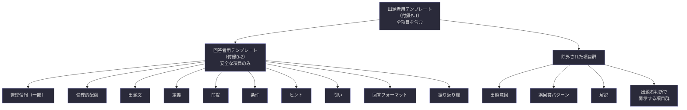

## 付録B-1：空テンプレート（出題者用）

そのままコピーして使用できる出題者用テンプレートである。全項目が記法付きの空欄状態で記載されている。

---

```
# Schiroga ── 問題設計シート

---

## 管理情報

|項目|内容|
|---|---|
|出題者|[ ]|
|作成日|[ YYYY/MM/DD ]|
|バージョン|[ v1.0 ]|

### 改訂履歴

|バージョン|日付|変更内容|
|---|---|---|
|v1.0|[ YYYY/MM/DD ]|[ 初版作成 ]|
|( )|( )|( )|

### 使用上の注意・倫理的配慮

|項目|内容|
|---|---|
|倫理的配慮の有無|[ 「該当なし」または具体的な注意事項 ]|
|心理的負荷の程度|< 低 / 中 / 高 >|
|対象制限|( )|

---

## 問題属性

|項目|内容|
|---|---|
|問題分類タグ|< 哲学 / 科学 / 知覚 / 数学 / 論理 / 言語 / その他: [ ] > ※複数選択可|
|出題形式タグ|< 記述式 / 選択式 / 対話式 / 実演式 / その他: [ ] >|
|対象人数|< 個人 / グループ（少人数）/ グループ（大人数）>|
|単独／連続|< 単独問題 / 連続問題 >|
|シリーズ名|( )|
|問題番号|( No. )|
|前提知識レベル|[ ]|
|必要知識①|[ ]|
|必要知識②|( )|
|表現レベル|< 小学生向け / 中学生向け / 高校生向け / 大学生・専門家向け >|
|難易度|< 初級 / 中級 / 上級 / 専門 >|

---

## 問題フォーマット本体

---

### 【出題文】

> [ 問題のテーマと何を問うかを一文で明示する ]

---

### 【出題文のバリエーション】（オプション）

|表現レベル|出題文|
|---|---|
|( )|( )|
|( )|( )|

---

### 【出題意図】

> [ 出題者が何を考えさせたいかを明示する ]

---

### 【定義】

> [ この問題で使用する言葉の意味を明示する ]
>
> - 用語①：[ ]
> - 用語②：[ ]
> - 用語③：( )

---

### 【前提】（種別ラベル付き）

> [ 問題における事実として共有する情報 ]
>
> - 前提① < 【事実】/【仮定】/【価値】>：[ ]
> - 前提② < 【事実】/【仮定】/【価値】>：[ ]
> - 前提③ < 【事実】/【仮定】/【価値】>：( )

---

### 【条件】

> [ この問題固有の状況設定 ]
>
> - 条件①：[ ]
> - 条件②：[ ]
> - 条件③：( )

---

### 【ヒント】（オプション）

> - ヒント①：( )
> - ヒント②：( )

---

### 【問い】

> [ 定義・前提・条件を踏まえた上で、何を答えるかを明示する ]
>
> 主問：[ ]
> 副問①：( )
> 副問②：( )

---

### 【回答フォーマット】

> - 回答①　〇〇とは：[ ]
> - 回答②　そう答える根拠：[ ]
> - 回答③　前提と矛盾する場合はその説明：[ ]

---

### 【想定回答時間の目安】（オプション）

|項目|内容|
|---|---|
|想定回答時間|( )|
|想定回答分量|( )|

---

### 【評価基準・ルーブリック】（オプション）

|観点|優れている|十分|不十分|
|---|---|---|---|
|( )|( )|( )|( )|
|( )|( )|( )|( )|

---

## オプション

---

### 【反論可能条件】（オプション）

> - 反論可能な範囲：( )
> - 反論不可な範囲：( )

---

### 【禁則事項】（オプション）

> - 禁則①：( )
> - 禁則②：( )

---

## 回答後の解説

---

### 【想定される誤回答パターン】

|パターン|誤りの理由|
|---|---|
|[ ]|[ ]|
|[ ]|[ ]|
|( )|( )|

> ⚠️ **注記** 誤回答とは書いてありますが、それが必ずしも間違いというわけではありません。
> むしろ、あなたの創造性や発想力などがとても素晴らしいことだってあります。
> それを否定したいわけではありません。

---

### 【解説】

**▼ 核心となる論点**

> [ この問題が何を問いたかったかの本質 ]

**▼ 根拠**

> - 根拠①：[ ]
> - 根拠②：[ ]
> - 根拠③：( )

**▼ 理由**

> - 理由①：[ ]
> - 理由②：( )

**▼ 発展的考察**（オプション）

> ( )

---

### 【関連問題へのリンク】（オプション）

|関係性|問題タイトル・識別子|
|---|---|
|( < 前提問題 / 発展問題 / 並行問題 / 対立問題 > )|( )|
|( )|( )|

---

### 【回答者の振り返り欄】（オプション）

|項目|回答者の記入欄|
|---|---|
|最初に思いついたこと|( )|
|回答中に変化したこと|( )|
|解説を読んで気づいたこと|( )|
|残った疑問|( )|

---

_© Schiroga v1.0_
```

---

## 付録B-2：空テンプレート（回答者用）

回答者に渡すためのテンプレートである。出題意図・解説・誤回答パターンなど、回答前に見せるべきでない項目は除外されている。

---

```
# Schiroga ── 回答シート

---

## 問題情報

|項目|内容|
|---|---|
|出題者||
|作成日||
|バージョン||
|問題分類タグ||
|出題形式タグ||
|難易度||

---

## 使用上の注意・倫理的配慮

> （出題者が記入した内容がここに転記される）

---

## 問題

---

### 【出題文】

> （出題者が記入した出題文がここに転記される）

---

### 【定義】

> （出題者が記入した定義がここに転記される）

---

### 【前提】（種別ラベル付き）

> （出題者が記入した前提がここに転記される）

---

### 【条件】

> （出題者が記入した条件がここに転記される）

---

### 【ヒント】

> （出題者がヒントを設定した場合、ここに転記される）

---

### 【問い】

> （出題者が記入した問いがここに転記される）

---

## 回答欄

---

### 【回答フォーマット】

> - 回答①　〇〇とは：
> - 回答②　そう答える根拠：
> - 回答③　前提と矛盾する場合はその説明：

---

### 【振り返り欄】（回答提出後・解説を読んだ後に記入）

|項目|記入欄|
|---|---|
|最初に思いついたこと||
|回答中に変化したこと||
|解説を読んで気づいたこと||
|残った疑問||

---

_© Schiroga v1.0_
```

---

**出題者用と回答者用の差分。** 回答者用テンプレートから除外されている項目を以下に示す。

|除外された項目|除外理由|
|---|---|
|出題意図（4-3）|回答前に見ると思考を誘導してしまう|
|出題文のバリエーション（4-2）|回答者には該当レベルの出題文のみ提示すれば足りる|
|想定回答時間（4-10）|出題者が開示を判断する。開示する場合は問題情報に転記する|
|評価基準（4-11）|出題者が開示を判断する。開示する場合は回答フォーマットの後に転記する|
|反論可能条件（5-1）|出題者が開示を判断する。開示する場合は前提の後に転記する|
|禁則事項（5-2）|出題者が開示を判断する。開示する場合は問いの後に転記する|
|想定される誤回答パターン（6-1）|回答前に見ると思考を制限してしまう|
|解説（6-2）|回答前に見ると問題として機能しなくなる|
|関連問題へのリンク（6-3）|解説の後に開示する情報|



---
