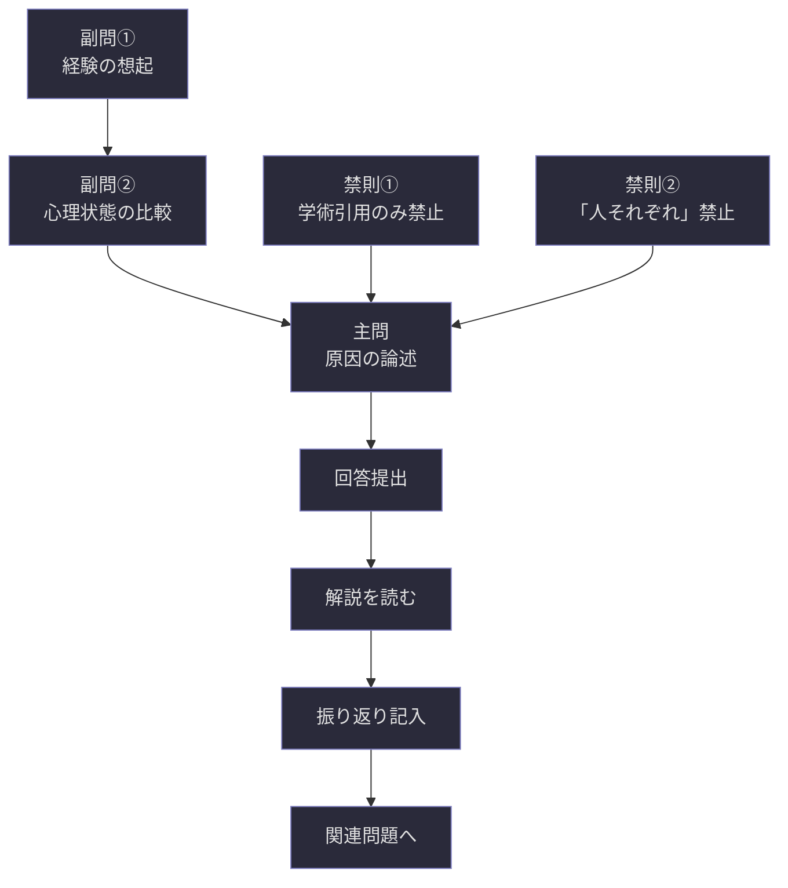

## 付録C：記入例（サンプル問題）

本テンプレートの全項目を実際に記入した完成例を一問掲載する。出題者がSchirogaをどのように使うかの実践的な参考資料である。

---

```
# Schiroga ── 問題設計シート

---

## 管理情報

| 項目    | 内容         |
| ----- | ---------- |
| 出題者   | 空繰妖華薫      |
| 作成日   | 2026/03/02 |
| バージョン | v1.0       |

### 改訂履歴

|バージョン|日付|変更内容|
|---|---|---|
|v1.0|2026/03/02|初版作成|

### 使用上の注意・倫理的配慮

|項目|内容|
|---|---|
|倫理的配慮の有無|該当なし|
|心理的負荷の程度|低|
|対象制限|なし|

---

## 問題属性

|項目|内容|
|---|---|
|問題分類タグ|哲学, 知覚|
|出題形式タグ|記述式|
|対象人数|個人|
|単独／連続|単独問題|
|シリーズ名|─|
|問題番号|─|
|前提知識レベル|日常的な経験があれば回答可能。専門知識は不要|
|必要知識①|自分自身の日常経験を振り返る能力|
|必要知識②|─|
|表現レベル|高校生向け|
|難易度|中級|

---

## 問題フォーマット本体

---

### 【出題文】

> 同じ一時間でも、状況によって長さが異なって感じられる現象の原因を、自身の経験に基づいて論じよ。

---

### 【出題文のバリエーション】

|表現レベル|出題文|
|---|---|
|小学生向け|たのしい時間はあっという間なのに、退屈な時間はすごく長く感じるのはなぜだろう？自分の経験から考えてみよう。|
|大学生・専門家向け|同一の客観的時間が主観的に異なる長さとして知覚される現象について、自己の経験的観察を基盤として、その認知的メカニズムを論述せよ。|

---

### 【出題意図】

> 回答者に「時間」という日常的な概念を哲学的に再考させたい。誰もが経験している現象でありながら、改めて「なぜ」と問われると言語化が難しい。この言語化のプロセスそのものを体験させることが本問の狙いである。

---

### 【定義】

> - 用語①：時間 ── この問題では、時計で計測される客観的時間ではなく、人間が主観的に体験する心理的時間を指す。
> - 用語②：知覚 ── 感覚器官を通じて外界の情報を受け取り、それを認識・解釈する心の働き。
> - 用語③：経験 ── 回答者自身が実際に体験した出来事。他者から聞いた話や書籍の知識は含まない。

---

### 【前提】（種別ラベル付き）

> - 前提①【事実】：人間は同じ客観的時間（例：一時間）を、状況によって異なる長さとして体験することがある。
> - 前提②【仮定】：この問題では、身体的疾病や薬物の影響による時間知覚の変化は考慮しないものとする。
> - 前提③【価値】：主観的な体験は、客観的な測定と同等に考察する価値がある。

---

### 【条件】

> - 条件①：回答には必ず自身の具体的な経験を一つ以上含めること。
> - 条件②：原因の考察は最低二つの異なる観点から行うこと。

---

### 【ヒント】

> - ヒント①：最近の一週間の中で、時間の流れ方が普段と違ったと感じた場面を思い出してみよう。
> - ヒント②：そのとき、あなたの「注意」は何に向いていただろうか。

---

### 【問い】

> 主問：同じ一時間が状況によって異なる長さに感じられる原因を、自身の経験に基づいて論じよ。
>
> 副問①：自分の経験の中で、時間が短く感じられた場面と長く感じられた場面をそれぞれ一つずつ挙げよ。
>
> 副問②：その二つの場面において、自分の心理状態にどのような違いがあったかを比較せよ。

---

### 【回答フォーマット】

> - 回答①　時間が異なる長さに感じられる原因とは：（副問①②を踏まえ、自身の言葉で論じる）
> - 回答②　そう答える根拠：（自身の経験を具体的に記述し、根拠とする）
> - 回答③　前提と矛盾する場合はその説明：（前提に同意する場合は「矛盾なし」と記述）

---

### 【想定回答時間の目安】

|項目|内容|
|---|---|
|想定回答時間|15〜30分|
|想定回答分量|400〜800字程度|

---

### 【評価基準・ルーブリック】

|観点|優れている|十分|不十分|
|---|---|---|---|
|経験の具体性|具体的な場面が鮮明に描写されている|場面が示されているが描写がやや抽象的|具体的な経験が示されていない|
|考察の深さ|複数の観点から原因を分析し、それらの関係にも言及している|二つ以上の観点から考察している|一つの観点のみ、または考察が表面的|
|論理の一貫性|経験→考察→結論の流れに飛躍がない|概ね論理的だが一部に飛躍がある|経験と結論が繋がっていない|

---

## オプション

---

### 【反論可能条件】

> - 反論可能な範囲：前提③【価値】に対する反論は可。「主観的体験に考察の価値はない」という立場からの回答も受け付ける。ただし、その場合は代替的な考察対象を提示すること。
> - 反論不可な範囲：前提①【事実】および前提②【仮定】。前提②は問題の範囲を限定するための仮定であり、この枠内で考察すること。

---

### 【禁則事項】

> - 禁則①：学術論文や教科書からの引用のみで回答を構成することを禁じる。理由：この問題は回答者自身の経験と思考を問うものであり、既存知識の再述は問いの趣旨に合わない。
> - 禁則②：「人それぞれ」「感じ方は個人差がある」のみで結論とすることを禁じる。理由：個人差の存在は前提として自明であり、その先にある「なぜ」を考察することが本問の目的である。

---

## 回答後の解説

---

### 【想定される誤回答パターン】

|パターン|誤りの理由|
|---|---|
|「脳の処理速度が変わるから」と生理学的説明のみで終わる|前提②で身体的要因は除外しており、条件①の「自身の経験」が含まれていない|
|「楽しいと短い、退屈だと長い」の現象記述のみで終わる|現象の記述は問いの前提であり、問われているのは「原因」である。問いのすり替えに該当|
|「時間は相対的なものだからである」と抽象論で終わる|抽象への逃避に該当。具体的経験に基づく考察が欠けている|

> ⚠️ **注記** 誤回答とは書いてありますが、それが必ずしも間違いというわけではありません。
> むしろ、あなたの創造性や発想力などがとても素晴らしいことだってあります。
> それを否定したいわけではありません。

---

### 【解説】

**▼ 核心となる論点**

> この問題が問いたかったのは「時間知覚の科学的メカニズム」ではなく、「自分自身の経験を言語化し、そこから一般的な洞察を導き出す思考のプロセス」そのものである。私たちは日々時間の伸縮を体験しながら、それを改めて言葉にすることは少ない。言語化を試みることで、無意識の経験が意識的な知識に変わる──その変換過程の体験が本問の核心である。

**▼ 根拠**

> - 根拠①：注意の配分と時間知覚の関係は、心理学研究において広く認められている。注意が時間の経過以外に向けられているとき、経過時間の主観的評価は短くなる傾向がある。
> - 根拠②：感情の喚起度（覚醒度）が高い状況では、内的時計のテンポが加速し、客観的時間よりも長い時間が経ったように感じられることがある。
> - 根拠③：記憶の密度もまた時間評価に影響する。豊かな記憶が形成された期間は、回想時に長く感じられる。

**▼ 理由**

> - 理由①：注意が没入対象に集中しているとき（例：好きなゲームをしているとき）、時間経過を監視する認知資源が不足するため、「気づいたら時間が過ぎていた」という体験が生じる。これが「楽しい時間は短い」の一因である。
> - 理由②：退屈な状況では注意の向け先が乏しく、時間経過そのものに意識が向きやすい。時間を繰り返し確認することで、まだこれしか経っていないという評価が生じ、体感時間が延長される。

**▼ 発展的考察**

> この問題を通じて「主観的体験の言語化」を経験した回答者は、次の問いに進むことができる──「もし時間の流れ方を自分の意志で変えられるとしたら、あなたはどう変えたいか。そしてそれは本当にあなたを幸福にするか。」この問いは、時間知覚の考察から幸福論への橋渡しとなる。

---

### 【関連問題へのリンク】

|関係性|問題タイトル・識別子|
|---|---|
|発展問題|「時間の流れを変えられるとしたら」（未作成）|
|並行問題|「空間の広さは心理状態で変わるか」（未作成）|
|対立問題|「主観的体験に学問的価値はあるか」（未作成）|

---

### 【回答者の振り返り欄】

|項目|記入欄|
|---|---|
|最初に思いついたこと|（回答者が記入）|
|回答中に変化したこと|（回答者が記入）|
|解説を読んで気づいたこと|（回答者が記入）|
|残った疑問|（回答者が記入）|

---

_© Schiroga v1.0_
```

---

### サンプル問題の設計意図解説

このサンプル問題がSchirogaの各機能をどのように活用しているかを以下に整理する。

|Schirogaの機能|このサンプルでの活用|
|---|---|
|種別ラベル|【事実】【仮定】【価値】の三種全てを使用し、反論可能条件との連携を実演|
|問いの階層化|副問①②で経験の想起と比較を促し、主問の論述に必要な材料を段階的に準備させている|
|出題文のバリエーション|小学生向けと大学生・専門家向けの二段階を併記し、表現レベル変更の実例を提示|
|禁則事項|「学術引用のみ」「人それぞれで終わる」の二種を設定し、思考を本質的方向に集中させている|
|誤回答パターン|定義の逸脱・問いのすり替え・抽象への逃避の三類型を具体的に例示|
|解説の四層構造|核心論点→根拠→理由→発展的考察の流れで、問題の全貌を段階的に開示|
|関連問題|発展・並行・対立の三種のリンクを設定し、探求の導線を示している|
|振り返り欄|回答者のメタ認知を促す四項目を配置|



---
