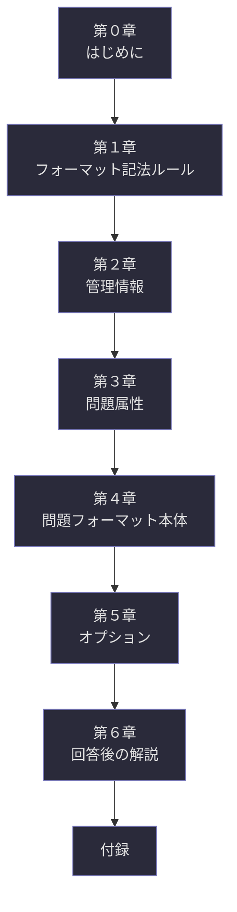

## 第0章：はじめに

### 0-1. Schirogaとは

Schiroga（スキロガ）は、問いを構造的に設計するための汎用フレームワークである。名称はラテン語の造語で、Schema（図式）と Interroga（問い）を結合した「Schiroga」に由来し、「問いの図式」を意味する。

本フレームワークの根底にある思想は一つだけ明確にしておきたい。Schirogaは「正解を効率よく導くための道具」ではない。問いそのものを丁寧に設計し、出題者と回答者の間に正確な思考の土俵を敷くための設計図である。

---

### 0-2. なぜSchirogaが必要か

問いの質は、回答の質を決定する。しかし多くの場合、問いは曖昧なまま投げかけられ、回答者は「何を聞かれているのか」を推測するところから始めなければならない。この推測のズレが、議論のすれ違いを生み、思考の深まりを妨げる。

Schirogaは、この問題を構造で解決する。用語の定義、共有すべき前提、問題固有の条件、そして問いそのものを明示的に分離・記述することで、出題者の意図と回答者の理解の間にある曖昧さを最小化する。

---

### 0-3. Schirogaの設計思想

Schirogaを貫く設計思想は以下の三点に集約される。

**第一に、分離の原則。** 定義・前提・条件・問いは、それぞれ異なる性質を持つ情報である。これらを混在させず、明確に分離して記述することで、議論のどの層で齟齬が生じているかを特定可能にする。

**第二に、明示の原則。** 暗黙の了解に頼らない。出題者が「当然わかるだろう」と思っている前提こそ、最も書き出す価値がある。言語化されない前提は、回答者にとっては存在しない前提と同じである。

**第三に、尊重の原則。** Schirogaは回答者を試すための仕組みではない。出題者と回答者が対等に思考を交わすための共通言語である。誤回答パターンの記載においても、それが「間違い」ではなく「別の視点」である可能性を常に認める姿勢を内包している。

---

### 0-4. 本資料の構成

本資料は以下の構成で Schiroga v1.0 の全体像を提示する。

第０章から第４章までが問題設計の核心部であり、第５章は拡張オプション、第６章は回答後の解説と振り返り機能、付録は実用のための参照資料群である。

---

### 0-5. 本資料の読み方

| 読者の目的            | 推奨する読み方                                      |
| ---------------- | -------------------------------------------- |
| 全体像を把握したい        | 第０章を読んだ後、目次テーブルで構成を確認し、興味のある章から読む            |
| すぐに問題を作りたい       | 付録B-1（空テンプレート・出題者用）をコピーし、わからない項目があれば該当章を参照する |
| すぐに回答したい         | 付録B-2（空テンプレート・回答者用）を確認し、回答フォーマットに従って記述する     |
| 記入例を見て学びたい       | 付録C（サンプル問題）を読み、各項目がどう使われるかを実例で理解する           |
| フォーマットの思想を深く知りたい | 第０章を精読した後、第４章の各節を順に読み進める                     |

---
