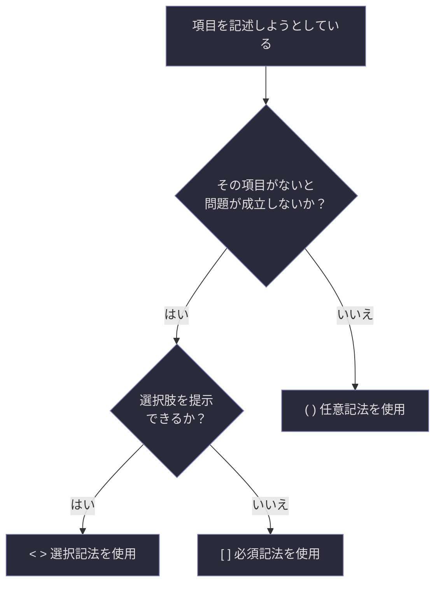

## 第1章：フォーマット記法ルール

---

### 1-1. 記法の定義

Schirogaでは、各項目の入力義務を三種類の括弧記法で明示する。この記法はテンプレート全体で一貫して使用される。

|記法|名称|意味|入力義務|
|---|---|---|---|
|`[ ]`|必須記法|この項目は必ず記入しなければならない|省略不可|
|`( )`|任意記法|この項目は必要に応じて記入する|省略可|
|`< >`|選択記法|提示された選択肢から一つ以上を選ぶ|選択必須（複数選択可の場合あり）|

---

### 1-2. 記法の使用例

具体的にテンプレート内でどのように現れるかを示す。

|記法|テンプレート上の表記例|記入後の例|
|---|---|---|
|`[ ]`|`[ 出題者の名前・識別子 ]`|ブラザー|
|`( )`|`( シリーズ名 )`|思考実験シリーズ|
|`( )`|`( シリーズ名 )`|（空欄のまま省略）|
|`< >`|`< 初級 / 中級 / 上級 / 専門 >`|上級|
|`< >`|`< 哲学 / 科学 / 知覚 / 数学 / 論理 / 言語 / その他: >`|哲学, 知覚|

---

### 1-3. 記法の判定フロー

どの記法を使うべきか迷った場合の判定基準を示す。

---

### 1-4. 記法に関する注意事項

**必須記法 `[ ]` について。** 必須項目が空欄のまま出題された場合、その問題は「不完全な問題」として扱われる。回答者は、空欄の必須項目について出題者に確認を求める権利を持つ。

**任意記法 `( )` について。** 任意項目を省略すること自体は問題ではないが、省略した項目が回答の質に影響する場合がある。出題者は、省略によって何が失われるかを意識した上で判断すべきである。

**選択記法 `< >` について。** 「複数選択可」と明記されている場合を除き、原則として単一選択とする。選択肢に該当するものがない場合は「その他」を選択し、具体的な内容を `[ ]` で補記する。

---

### 1-5. 記法一覧表（クイックリファレンス）

テンプレート使用時に手元で確認するための早見表を以下に示す。

|記法|読み方|一言で言うと|省略|複数選択|
|---|---|---|---|---|
|`[ ]`|必須|「必ず書け」|不可|-|
|`( )`|任意|「あれば書け」|可|-|
|`< >`|選択|「選べ」|不可（選択自体は必須）|明記時のみ可|

---
