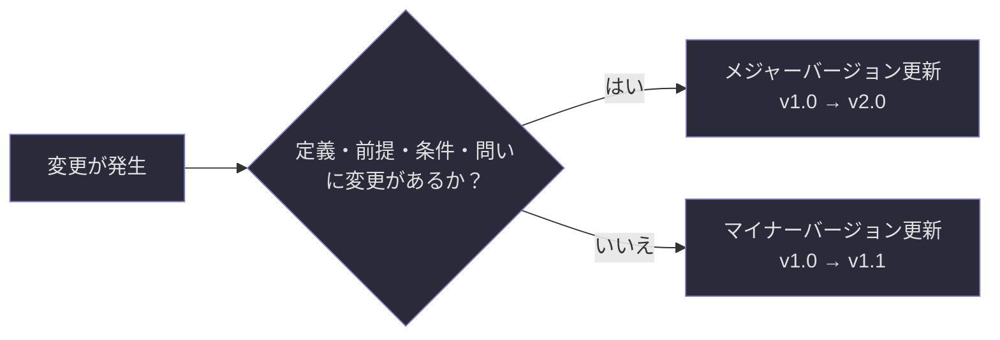
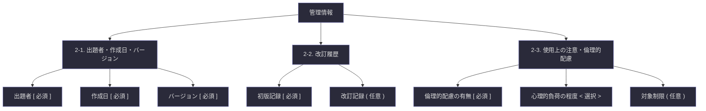

## 第2章：管理情報

### 2-1. 出題者・作成日・バージョン

問題のメタデータを記録する領域である。誰が、いつ、どの版として作成したかを明示することで、問題の追跡可能性を担保する。

|項目|記法|記入内容|備考|
|---|---|---|---|
|出題者|`[ ]`|名前・識別子・ペンネーム等|匿名の場合も識別可能な記号を推奨|
|作成日|`[ ]`|YYYY/MM/DD 形式|西暦で統一する|
|バージョン|`[ ]`|v〇.〇 形式|初版は必ず v1.0 から開始|

**バージョニング規則について。** 問題の本質（定義・前提・条件・問い）に変更が入った場合はメジャーバージョン（v1.0 → v2.0）を繰り上げる。表現の修正、誤字の訂正、ヒントの追加など本質に影響しない変更はマイナーバージョン（v1.0 → v1.1）で対応する。

---

### 2-2. 改訂履歴

問題に加えられた変更の履歴を記録する領域である。初版（v1.0）の行は必須、以降の改訂行は任意で追加する。

|バージョン|日付|変更内容|
|---|---|---|
|`[ v1.0 ]`|`[ YYYY/MM/DD ]`|`[ 初版作成 ]`|
|`( v1.1 )`|`( YYYY/MM/DD )`|`( 変更内容を簡潔に記述 )`|
|`( v2.0 )`|`( YYYY/MM/DD )`|`( 変更内容を簡潔に記述 )`|

**改訂履歴の記述粒度について。** 変更内容は「何を」「どう変えたか」が一読で分かる粒度を心がける。「修正した」だけでは不十分であり、「前提②の表現を中学生向けに言い換えた」のように具体的に記述する。

---

### 2-3. 使用上の注意・倫理的配慮

問題の内容が回答者に心理的負荷を与える可能性がある場合、事前にその旨を告知する領域である。この項目は必須とする。該当しない場合も「該当なし」と明記する。

|項目|記法|記入内容|
|---|---|---|
|倫理的配慮の有無|`[ ]`|「該当なし」または具体的な注意事項を記述|
|心理的負荷の程度|`< 低 / 中 / 高 >`|回答者への心理的影響度の自己評価|
|対象制限|`( )`|特定の対象に出題すべきでない場合に記述|

**なぜ「該当なし」でも必須なのか。** この項目を任意にすると、空欄が「配慮の必要がない」のか「出題者が考慮し忘れた」のかが区別できなくなる。「該当なし」と書く行為そのものが、出題者が倫理面を意識的に検討した証拠となる。

**配慮が必要となる主なテーマの例。** 死生観、自殺、暴力、差別、トラウマに関連するテーマ、強い価値観の対立を含むテーマ、個人的な信仰や信条に深く関わるテーマなどが挙げられる。これらに該当する場合は、問題の冒頭に注意書きを添えることを推奨する。

---

### 2-4. 管理情報の全体構造

第２章で定義した管理情報の構成要素と、その関係を以下に示す。

---
