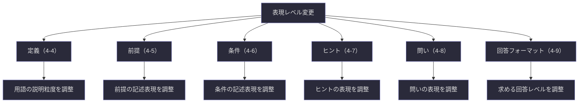
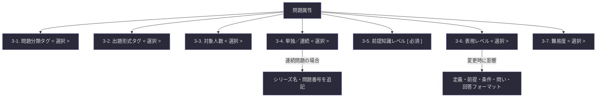

## 第3章：問題属性

---

### 3-1. 問題分類タグ

問題がどの知識分野に属するかを分類する領域である。回答者が問題に取り組む前に、どの領域の思考が求められるかを事前に把握できるようにする。

|項目|記法|選択肢|
|---|---|---|
|問題分類タグ|`< >` 複数選択可|哲学 / 科学 / 知覚 / 数学 / 論理 / 言語 / その他: `[ ]`|

**「その他」を選択した場合。** 具体的な分野名を `[ ]` で補記する。例えば「その他: 音楽理論」「その他: 心理学」のように、回答者が分野を特定できる粒度で記述する。

**複数選択の場合。** 分野間に主従関係がある場合は、主となる分野を先に記述することを推奨する。例えば哲学的問いに科学的知識が必要な場合は「哲学, 科学」の順とする。

---

### 3-2. 出題形式タグ

問題がどのような形式で出題されるかを明示する領域である。回答者は出題形式を知ることで、思考の構えと回答の準備を適切に整えることができる。

|項目|記法|選択肢|
|---|---|---|
|出題形式タグ|`< >`|記述式 / 選択式 / 対話式 / 実演式 / その他: `[ ]`|

各形式の定義を以下に示す。

|出題形式|定義|回答者に求められること|
|---|---|---|
|記述式|文章で回答を記述する形式|論理的な文章構成、根拠の提示|
|選択式|提示された選択肢から選ぶ形式|選択と、その選択理由の説明|
|対話式|出題者と回答者が対話を通じて深める形式|応答の柔軟性、問い返す力|
|実演式|実際に何かを行い、その結果を示す形式|実行力、プロセスの記録|
|その他|上記に該当しない形式|`[ ]` で具体的に記述|

**出題形式と回答フォーマットの関係について。** 出題形式は「どう問うか」であり、回答フォーマット（第４章 4-9）は「どう答えるか」である。両者は密接に連動するが、同一ではない。例えば対話式の出題であっても、最終的な回答は記述式で求める場合がある。

---

### 3-3. 対象人数

問題が想定する回答者の人数規模を明示する領域である。

|項目|記法|選択肢|
|---|---|---|
|対象人数|`< >`|個人 / グループ（少人数）/ グループ（大人数）|

|対象人数|想定規模|特徴|
|---|---|---|
|個人|1人|内省的な思考を促しやすい|
|グループ（少人数）|2〜6人程度|対話と議論が成立しやすい|
|グループ（大人数）|7人以上|多様な視点が集まるが、収束に工夫が必要|

---

### 3-4. 単独／連続

問題が単独で完結するか、シリーズの一部であるかを明示する領域である。

|項目|記法|選択肢|
|---|---|---|
|単独／連続|`< >`|単独問題 / 連続問題|
|シリーズ名|`( )`|連続問題の場合に記述|
|問題番号|`( )`|連続問題の場合に記述（No.〇）|

**連続問題の場合の注意事項。** 前の問題の回答を前提とする場合は、その旨を前提セクション（第４章 4-5）に明記する。回答者が前の問題を未回答でも取り組めるかどうかも記述しておくと親切である。

---

### 3-5. 前提知識レベル

問題を解くために回答者に求められる前提知識を明示する領域である。

|項目|記法|記入内容|
|---|---|---|
|前提知識の概要|`[ ]`|この問題を解くために必要な知識を明示する|
|必要知識①|`[ ]`|具体的な知識領域・概念を記述|
|必要知識②|`( )`|追加の知識領域がある場合に記述|
|必要知識③〜|`( )`|必要に応じて追加|

**前提知識と難易度の関係について。** 前提知識レベルは「何を知っている必要があるか」であり、難易度（3-7）は「その知識を使ってどれだけ深く考える必要があるか」である。前提知識が少なくても難易度が高い問題は存在するし、前提知識が多くても難易度が低い問題もある。

---

### 3-6. 表現レベル

問題文の言語的難易度を明示する領域である。表現レベルを変更すると、複数の項目に影響が波及する。

|項目|記法|選択肢|
|---|---|---|
|表現レベル|`< >`|小学生向け / 中学生向け / 高校生向け / 大学生・専門家向け|

**表現レベル変更時の影響範囲。** 表現レベルを変更した場合、以下の項目を連動して調整する必要がある。

|影響を受ける項目|章・節|調整内容|
|---|---|---|
|定義|4-4|用語の説明粒度を変更|
|前提|4-5|前提の記述表現を変更|
|条件|4-6|条件の記述表現を変更|
|ヒント|4-7|ヒントの表現を変更|
|問い|4-8|問いの表現を変更|
|回答フォーマット|4-9|求める回答の記述レベルを変更|

**出題文のバリエーション（4-2）との関係。** 複数の表現レベルで同一の問題を出題する場合、出題文のバリエーション欄を活用して各レベルの出題文を併記できる。

---

### 3-7. 難易度

問題の思考的難しさを明示する領域である。

|項目|記法|選択肢|
|---|---|---|
|難易度|`< >`|初級 / 中級 / 上級 / 専門|

各難易度の目安を以下に示す。

|難易度|目安|期待される思考|
|---|---|---|
|初級|定義と前提を理解すれば答えられる|理解・再現|
|中級|条件を組み合わせた推論が必要|分析・適用|
|上級|複数の視点や前提の吟味が必要|統合・評価|
|専門|高度な専門知識と独創的思考が必要|創造・批判的検討|

---

### 3-8. 問題属性の全体構造

第３章で定義した問題属性の構成要素と、その関係を以下に示す。

---
