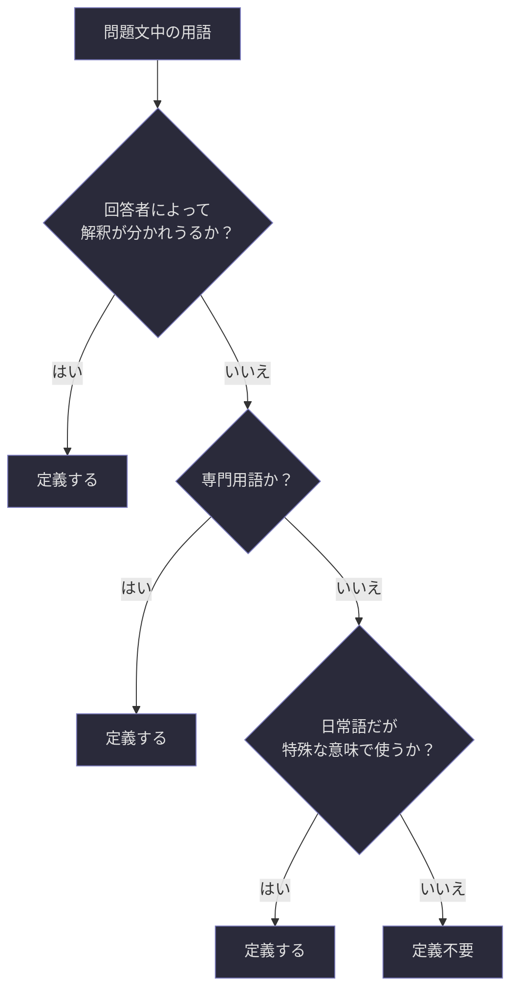
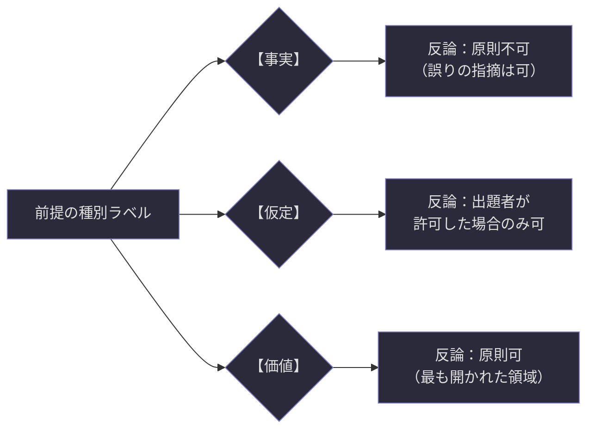
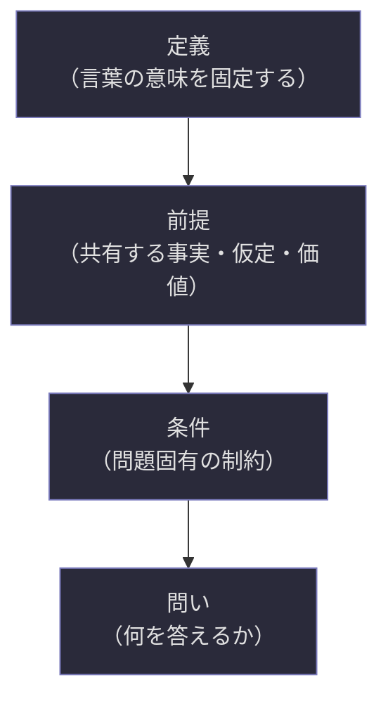
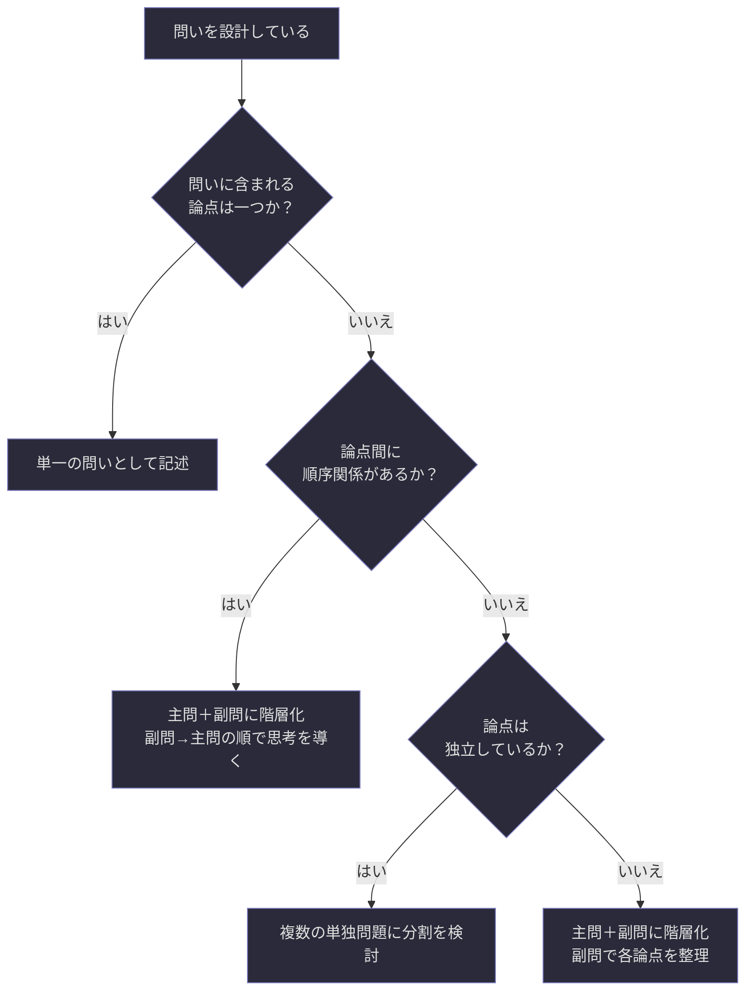
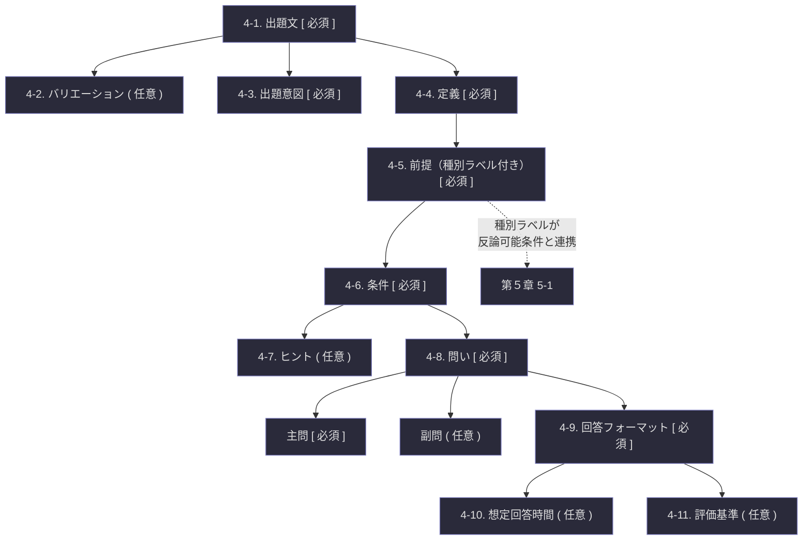

## 第4章：問題フォーマット本体

### 4-1. 出題文

問題のテーマと何を問うかを一文で明示する領域である。回答者が最初に目にする文であり、問題全体の方向性を一瞬で伝える役割を持つ。

|項目|記法|記入内容|
|---|---|---|
|出題文|`[ ]`|問題のテーマと何を問うかを一文で明示する|

**出題文の設計原則。** 出題文は「一文」に限定する。複数の文に分割したくなった場合、それは問いが複合化している兆候であり、主問・副問の階層化（4-8）を検討すべきである。

**良い出題文の条件。** 出題文は以下の三要素を含むことを推奨する。

|要素|説明|例|
|---|---|---|
|テーマ|何についての問題か|「時間の知覚について」|
|対象|何を考えるのか|「主観的な時間の速さの変化を」|
|動作|何をすればよいか|「説明せよ」|

上記三要素を統合した出題文の例：「時間の知覚において、主観的な時間の速さが変化する原因を説明せよ。」

---

### 4-2. 出題文のバリエーション（オプション）

同一の問題を異なる表現レベルで出題する場合に、各レベルの出題文を併記する領域である。

|項目|記法|記入内容|
|---|---|---|
|バリエーション|`( )`|表現レベル別の出題文を記述|

**記述形式。** 表現レベル（3-6）と対応させて記述する。

|表現レベル|出題文のバリエーション例|
|---|---|
|小学生向け|「楽しいときと退屈なとき、時間の早さがちがうのはなぜだろう？」|
|中学生向け|「楽しい時間は短く、退屈な時間は長く感じる理由を考えてみよう。」|
|高校生向け|「主観的な時間知覚の速度が状況によって変化する要因を論じよ。」|
|大学生・専門家向け|「時間の知覚において、主観的な時間の速さが変化する原因を説明せよ。」|

**使用上の注意。** 全ての表現レベルを併記する必要はない。実際に出題するレベルのみで十分である。ただし、将来的に別レベルへ展開する可能性がある場合は、あらかじめ記述しておくと再設計の手間が省ける。

---

### 4-3. 出題意図

出題者が回答者に何を考えさせたいかを明示する領域である。この項目は回答者に見せる場合と見せない場合がある。

|項目|記法|記入内容|
|---|---|---|
|出題意図|`[ ]`|出題者が何を考えさせたいかを明示する|

**出題意図と出題文の違い。** 出題文は「何を問うか」であり、出題意図は「なぜそれを問うか」である。出題文が表面的な問いであるのに対し、出題意図はその問いの奥にある本当の狙いを記述する。

|要素|出題文|出題意図|
|---|---|---|
|役割|回答者への問いかけ|出題者自身の目的の明文化|
|対象|回答者が必ず読む|出題者用（回答者に公開するかは任意）|
|記述内容|何を答えるか|何を考えさせたいか・何に気づかせたいか|

**出題意図の公開判断。** 出題前に公開すると回答を誘導してしまう場合がある。一方、出題後に公開すると「そういうことを聞きたかったのか」という理解の深化につながる。公開タイミングは出題者が判断する。

---

### 4-4. 定義

問題で使用する言葉の意味を固定する領域である。Schirogaにおいて最も重要な項目の一つであり、議論のすれ違いを構造的に防ぐ基盤となる。

|項目|記法|記入内容|
|---|---|---|
|用語①|`[ ]`|用語名と、この問題における定義|
|用語②|`[ ]`|同上|
|用語③〜|`( )`|必要に応じて追加|

**定義の設計原則。** 定義は「この問題の中ではこの意味で使う」という宣言であり、その用語の一般的・学術的な定義と異なっていても構わない。ただし、一般的な定義と異なる場合はその旨を明記すべきである。

**何を定義すべきか。** 以下の判定基準に従う。

**定義の記述例。**

|用語|この問題における定義|一般的定義との差異|
|---|---|---|
|時間|主観的に知覚される心理的時間|物理的時間（時計時間）は含まない|
|知覚|感覚器官を通じた情報の認識と解釈|一般的定義と同一|
|速さ|心理的時間の進行に対する体感的評価|物理的速度とは無関係|

---

### 4-5. 前提（種別ラベル付き）

問題における事実として共有する情報を明示する領域である。回答者が受け入れるべき条件であり、Schiroga v1.0 では各前提に種別ラベルを付与する。

|項目|記法|記入内容|
|---|---|---|
|前提①|`[ ]`|前提の内容＋種別ラベル|
|前提②|`[ ]`|同上|
|前提③〜|`( )`|必要に応じて追加|

**種別ラベルの定義。** 各前提に以下のいずれかのラベルを付与する。

| 種別ラベル | 定義               | 性質          | 例                      |
| ----- | ---------------- | ----------- | ---------------------- |
| 【事実】  | 客観的に検証可能な事実      | 反論の余地が最も小さい | 「水は標準気圧下で100℃で沸騰する」    |
| 【仮定】  | この問題のために設定した仮の条件 | 問題の中でのみ有効   | 「全ての人間が同じ速度で老化すると仮定する」 |
| 【価値】  | 価値判断を含む前提        | 最も反論の余地が大きい | 「幸福とは苦痛の不在である」         |

**種別ラベルと反論可能条件の連携。** 種別ラベルは、第５章の反論可能条件（5-1）と直接連携する。どの前提に異議を唱えてよいかを判定する際の基準として機能する。

**前提の記述例。**

|前提|種別|内容|
|---|---|---|
|前提①|【事実】|人間は外部からの刺激に対して主観的な時間評価を行う|
|前提②|【仮定】|この問題では、身体的な疾病による時間知覚の変化は考慮しない|
|前提③|【価値】|主観的経験は客観的測定と同等の認識的価値を持つ|

---

### 4-6. 条件

前提の上に乗る、問題固有の状況設定を明示する領域である。前提が「共有すべき土台」であるのに対し、条件は「この問題だけに適用される制約」である。

|項目|記法|記入内容|
|---|---|---|
|条件①|`[ ]`|問題固有の状況設定・制約|
|条件②|`[ ]`|同上|
|条件③〜|`( )`|必要に応じて追加|

**前提と条件の違い。** この二つは混同されやすいが、明確に異なる。

|比較項目|前提|条件|
|---|---|---|
|性質|問題の外でも成り立ちうる共有事実・仮定・価値|この問題の中でのみ有効な制約|
|役割|議論の土俵を敷く|土俵の上にルールを設ける|
|変更の影響|変更すると問題の本質が変わる|変更すると問題の難度や方向が変わる|
|例|「人間は時間を知覚する」|「回答は3つの要因に限定して述べよ」|

この図は、Schirogaにおける「定義→前提→条件→問い」の積層構造を示している。各層は下の層を土台として成立しており、上位層だけを変更しても下位層は維持される。

---

### 4-7. ヒント（オプション）

回答者の思考を助ける補助情報を提示する領域である。

|項目|記法|記入内容|
|---|---|---|
|ヒント①|`( )`|思考の補助となる情報|
|ヒント②〜|`( )`|必要に応じて追加|

**ヒントの設計原則。** ヒントは「答えそのもの」を与えてはならない。回答者の思考を促す方向を示すものであり、思考の代替ではない。

|ヒントの質|例|判定|
|---|---|---|
|良いヒント|「日常の中で時間の速さが変わる場面を思い出してみよう」|思考の方向を示している|
|悪いヒント|「注意の集中度が時間知覚に影響する」|答えの一部を与えてしまっている|

**段階的ヒントの活用。** 複数のヒントを用意する場合、抽象度の高いものから低いものへ段階的に配置することを推奨する。回答者はヒント①で考え、行き詰まったらヒント②を読む、という使い方が可能になる。

---

### 4-8. 問い（主問・副問の階層化対応）

定義・前提・条件を踏まえた上で、回答者が何を答えるかを明示する領域である。単純な問いはそのまま記述し、複合的な問いは主問と副問に階層化できる。

|項目|記法|記入内容|
|---|---|---|
|問い（単一の場合）|`[ ]`|何を答えるかを明示する|
|主問（階層化する場合）|`[ ]`|最終的に答えてほしいこと|
|副問①（階層化する場合）|`( )`|主問に至る途中で考えてほしいこと|
|副問②〜|`( )`|必要に応じて追加|

**階層化の判定基準。** 以下に該当する場合、問いの階層化を検討すべきである。

**階層化の記述例。**

|階層|内容|
|---|---|
|副問①|「日常生活の中で、時間の速さが変わったと感じた経験を一つ挙げよ」|
|副問②|「その経験において、何が時間の速さに影響を与えたと考えるか」|
|主問|「副問①②を踏まえ、主観的な時間知覚の速度が変化する一般的な原因を論じよ」|

副問は主問への足場であり、副問を考えることで主問に答えるための材料が揃う構造を意図している。

---

### 4-9. 回答フォーマット

回答者が何をどう答えるかの形式を指定する領域である。

|項目|記法|記入内容|
|---|---|---|
|回答①|`[ ]`|第一の回答項目とその形式|
|回答②|`[ ]`|第二の回答項目とその形式|
|回答③|`[ ]`|前提と矛盾する場合はその説明|
|回答④〜|`( )`|必要に応じて追加|

**回答③の意味について。** 回答フォーマットに「前提と矛盾する場合はその説明」を含めているのは、回答者が前提に対して疑問を持つ可能性を構造的に受け止めるためである。回答者が前提を受け入れた上で回答する場合、回答③は「矛盾なし」と記述すればよい。前提の種別ラベルが【価値】の場合、ここで異議を表明する機会が生まれる。

**回答フォーマットの設計原則。** 回答フォーマットは「自由に書いてください」ではなく、何をどの順番で書くかを具体的に指定する。これは回答者の自由を制限するためではなく、思考の構造化を支援するためである。

---

### 4-10. 想定回答時間の目安（オプション）

回答に期待される思考の深さと分量を間接的に伝える領域である。

|項目|記法|記入内容|
|---|---|---|
|想定回答時間|`( )`|時間の目安（例：5分程度、30分〜1時間）|
|想定回答分量|`( )`|分量の目安（例：200〜400字程度）|

**時間と分量の関係。** 両方を記述する必要はない。どちらか一方でも、回答者が「どの程度の深さを求められているか」を推測する手がかりになる。

|想定時間|暗に伝わるメッセージ|
|---|---|
|1〜5分|直感的・端的な回答を期待している|
|10〜30分|ある程度の論理構成を期待している|
|1時間以上|深い思索と精緻な論述を期待している|
|記述なし|回答者の判断に委ねる|

---

### 4-11. 評価基準・ルーブリック（オプション）

良い回答の基準を明示する領域である。教育目的やグループワークでの使用時に特に有効だが、哲学的問いなど「正解がない」性質の問題では慎重に扱う必要がある。

|項目|記法|記入内容|
|---|---|---|
|評価基準|`( )`|回答を評価する際の観点と基準|

**ルーブリックの記述形式。** 観点ごとに段階的な基準を示す。

|観点|優れている|十分|不十分|
|---|---|---|---|
|論理性|根拠が明確で一貫した論理展開|根拠が概ね示されている|根拠が不明確または飛躍がある|
|独創性|独自の視点や新たな問いを含む|一般的だが的確な視点|既存の見解の再述に留まる|
|前提との整合性|前提を踏まえ、矛盾時の説明も完備|前提を概ね踏まえている|前提を無視している|

**使用上の注意。** ルーブリックは「この回答でなければならない」という正解を示すものではない。あくまで「出題者がどの観点を重視しているか」を開示するものであり、回答の多様性を排除する意図で使用してはならない。

---

### 4-12. 問題フォーマット本体の全体構造

第４章で定義した全要素の関係と流れを以下に示す。

---
