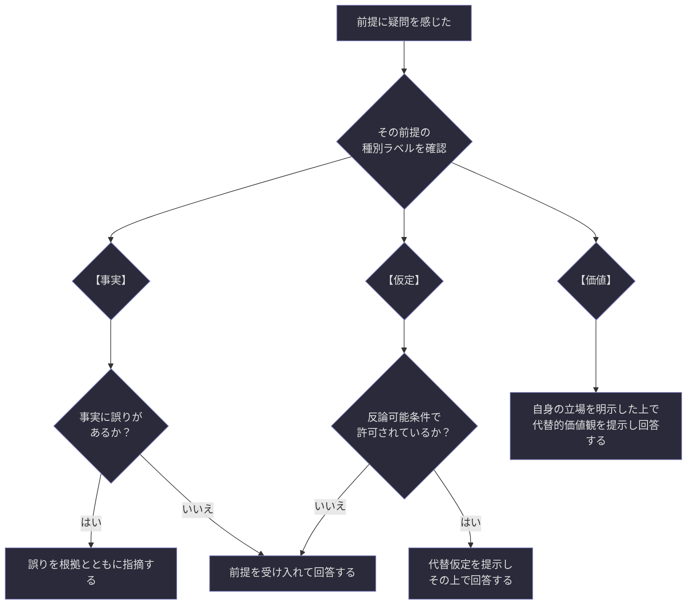
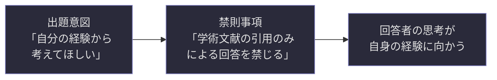
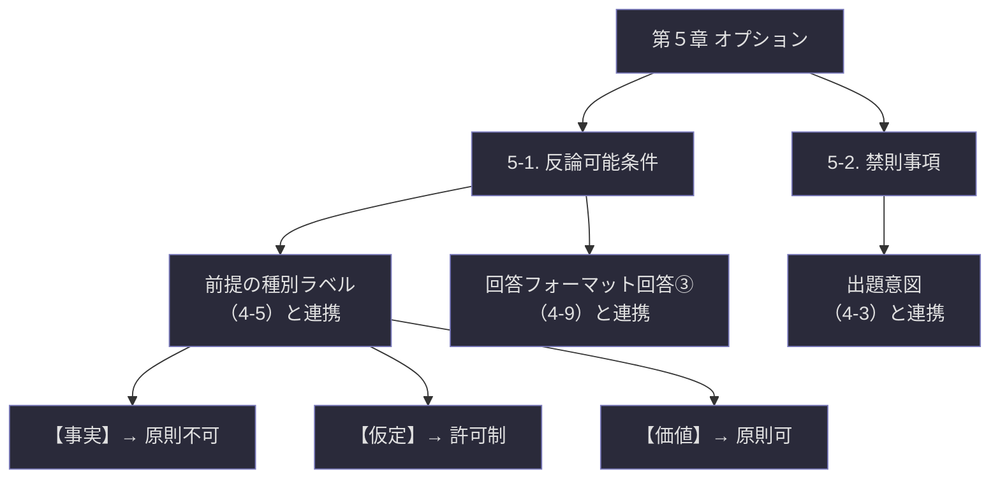

## 第5章：オプション

### 5-1. 反論可能条件

定義や前提に対して回答者が異議を唱えてよい範囲を明示する領域である。この項目を設けることで、回答者に「前提を疑う自由」を制御可能な形で与える。

|項目|記法|記入内容|
|---|---|---|
|反論可能な範囲|`( )`|異議を唱えてよい対象と条件|
|反論不可な範囲|`( )`|異議を唱えてはならない対象とその理由|

**種別ラベルとの連携。** 第４章 4-5 で前提に付与した種別ラベルが、反論の可否判定における第一の基準となる。

|種別ラベル|反論の原則|補足|
|---|---|---|
|【事実】|原則不可|ただし事実の誤りを指摘することは可。反論ではなく「訂正」の扱い|
|【仮定】|出題者の許可制|出題者が反論可能条件で明示的に許可した場合のみ可|
|【価値】|原則可|価値判断は本質的に議論に開かれている。ただし出題者が限定する場合もある|

**反論の作法。** 反論が許可されている場合でも、回答者は以下の手順を踏むことを推奨する。

**反論と回答の両立について。** 反論は回答の放棄ではない。前提に異議を唱える場合でも、回答フォーマット（4-9）の回答③「前提と矛盾する場合はその説明」に記述した上で、可能な限り問い自体にも回答することを推奨する。反論だけで終わる回答は、対話を閉じてしまう。

---

### 5-2. 禁則事項

NG回答の制約を明示する領域である。回答者が陥りやすい「的外れな方向」をあらかじめ封じることで、思考を本質的な方向に集中させる。

|項目|記法|記入内容|
|---|---|---|
|禁則①|`( )`|禁止する回答の内容・方向性とその理由|
|禁則②〜|`( )`|必要に応じて追加|

**禁則事項の設計原則。** 禁則事項は「何を禁じるか」だけでなく「なぜ禁じるか」を併記する。理由のない禁則は回答者にとって恣意的な制約に見え、思考の自由を不当に奪うものとして受け取られる可能性がある。

|記述の質|例|判定|
|---|---|---|
|良い禁則|「辞書的定義の引用のみで回答することを禁じる。理由：この問題は回答者自身の思考を問うものであり、既存の定義の再述は問いの趣旨に合わない」|理由が明確|
|悪い禁則|「辞書的定義を引用してはならない」|理由が不明|

**禁則事項と出題意図の関係。** 禁則事項は出題意図（4-3）の裏返しであることが多い。出題者が「こう考えてほしい」という意図を持っている場合、その逆の方向を禁則として明示することで、意図の精度が高まる。

---

### 5-3. オプションの全体構造

第５章で定義したオプション要素の位置づけと他章との連携を以下に示す。

---
