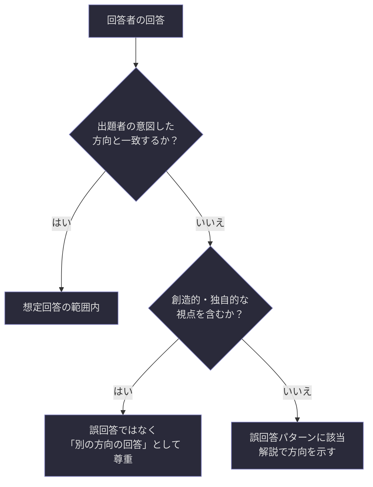
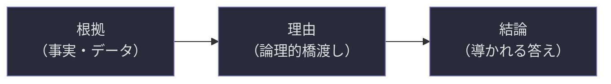
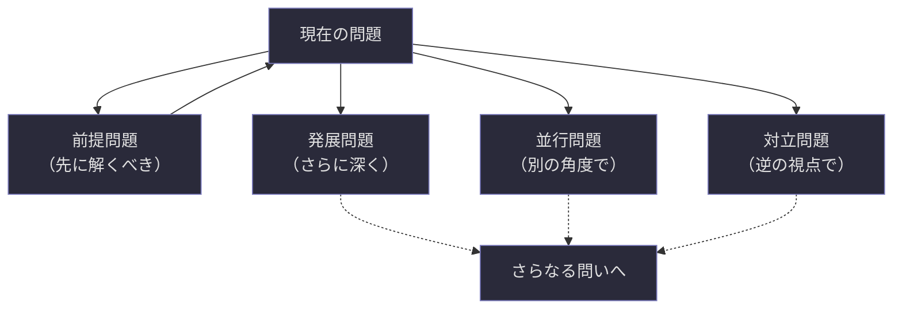
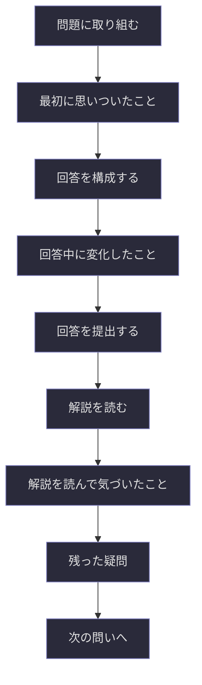
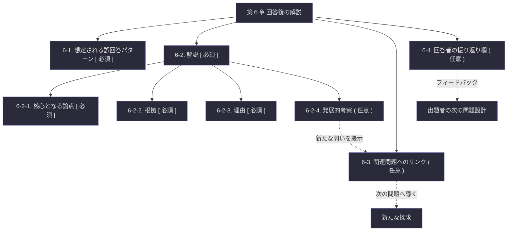

## 第6章：回答後の解説

---

### 6-1. 想定される誤回答パターン

回答者が陥りやすい誤った方向性や、よくある逃げ方をあらかじめ明示する領域である。出題者が問題を設計する段階で「こういう回答が来るだろう」と予測しておくことで、解説の精度が高まる。

|項目|記法|記入内容|
|---|---|---|
|誤回答パターン|`[ ]`|パターンの内容と、それが誤りである理由|

**記述形式。** テーブル形式で、パターンと誤りの理由を対にして記述する。

|パターン|誤りの理由|
|---|---|
|`[ 誤回答①の内容 ]`|`[ なぜこの回答が的外れなのか ]`|
|`[ 誤回答②の内容 ]`|`[ なぜこの回答が的外れなのか ]`|
|`( 誤回答③〜 )`|`( 必要に応じて追加 )`|

**「誤回答」という呼称についての重要な注記**：誤回答とは書いてあるが、それが必ずしも間違いというわけではない。むしろ、回答者の創造性や発想力が別の方向に発揮された結果であることも多い。この項目の目的は回答者を否定することではなく、出題者が「本来問いたかった方向」と「回答者が進みやすい別の方向」のズレを可視化することにある。

**誤回答パターンの典型的分類。** 出題者がパターンを設計する際の参考として、以下の分類を提示する。

|分類|説明|例|
|---|---|---|
|定義の逸脱|定義された用語を別の意味で解釈している|「時間」を物理的時間として回答|
|前提の無視|前提として提示された条件を無視している|「疾病は考慮しない」の前提を無視して脳疾患の話をする|
|条件の見落とし|条件で指定された制約を満たしていない|「3つの要因に限定」なのに5つ挙げている|
|問いのすり替え|問われていることとは別のことに答えている|「原因を論じよ」に対して「現象の列挙」で終わっている|
|抽象への逃避|具体的思考を避け、抽象的な一般論に留まる|「時間とは相対的なものである」で終わる|

---

### 6-2. 解説

問いが終わった後に出題者が種明かしをする領域である。解説は四つの層で構成される。

---

#### 6-2-1. 核心となる論点

この問題が何を問いたかったかの本質を記述する。出題意図（4-3）をさらに深めた内容であり、回答を踏まえた上での「この問題の本当の核心」を開示する場所である。

|項目|記法|記入内容|
|---|---|---|
|核心論点|`[ ]`|この問題が問いたかったことの本質|

**出題意図との違い。** 出題意図は「出題前に出題者が持っていた狙い」であり、核心論点は「回答を経て明らかになる問題の本質」である。両者は多くの場合一致するが、回答者の回答によって出題者自身が気づかなかった論点が浮上する場合もある。その場合、核心論点は出題意図を超えて拡張される。

---

#### 6-2-2. 根拠

解説を支える事実・論理的根拠を記述する。

|項目|記法|記入内容|
|---|---|---|
|根拠①|`[ ]`|解説を支える事実または論理|
|根拠②|`[ ]`|同上|
|根拠③〜|`( )`|必要に応じて追加|

**根拠の記述原則。** 根拠は検証可能であることを重視する。学術的な引用、具体的な事例、論理的な推論のいずれかによって裏付けられるべきである。「私がそう思うから」は根拠ではない。

---

#### 6-2-3. 理由

なぜその根拠からその結論が導かれるのかを説明する。根拠と結論の間にある論理的な橋渡しである。

|項目|記法|記入内容|
|---|---|---|
|理由①|`[ ]`|根拠から結論への論理的接続|
|理由②|`( )`|必要に応じて追加|

**根拠と理由の違い。** 根拠は「何が事実か」であり、理由は「なぜその事実からこの結論に至るか」である。

|要素|役割|例|
|---|---|---|
|根拠|事実・データを示す|「注意資源が限定される状況では、時間経過への意識が減少する（先行研究より）」|
|理由|事実と結論を結ぶ|「時間経過への意識が減少すると、経過時間の主観的評価が短くなるため、楽しい時間は短く感じられる」|
|結論|導かれる答え|「注意の配分が主観的時間知覚の速度変化の主要因である」|

---

#### 6-2-4. 発展的考察（オプション）

この問題からさらに広がる問いや関連テーマを提示する領域である。問いは一つの問いで完結するものではなく、次の問いへの入口であるという思想に基づく。

|項目|記法|記入内容|
|---|---|---|
|発展的考察|`( )`|この問題から派生する新たな問い・テーマ|

**発展的考察の設計原則。** 発展的考察は「答えの延長」ではなく「新たな問いの提示」であるべきである。回答者がこの問題を通じて得た視点を、さらに別の方向に展開させる導線の役割を果たす。

---

### 6-3. 関連問題へのリンク（オプション）

この問題に関連する他の問題への導線を提示する領域である。

|項目|記法|記入内容|
|---|---|---|
|関連問題①|`( )`|関連する問題のタイトル・識別子・リンク先|
|関連問題②〜|`( )`|必要に応じて追加|

**リンクの種類。** 関連問題との関係性を明示することで、回答者が次にどの問題に進むべきかの判断材料を提供する。

|関係性|説明|記述例|
|---|---|---|
|前提問題|この問題を解く前に取り組むべき問題|「→ 前提問題：『知覚とは何か』（No.01）」|
|発展問題|この問題の先にある、より深い問題|「→ 発展問題：『時間は実在するか』（No.05）」|
|並行問題|同じテーマを別の角度から扱う問題|「→ 並行問題：『空間の知覚と時間の知覚の共通点』（No.03）」|
|対立問題|この問題と逆の前提・視点を持つ問題|「→ 対立問題：『主観的時間に価値はあるか』（No.07）」|

---

### 6-4. 回答者の振り返り欄（オプション）

回答者自身が、自分の思考過程を振り返るための領域である。出題者が設計するものではなく、回答者が記入するための場所を用意しておくという性質を持つ。

|項目|記法|記入内容（回答者が記入）|
|---|---|---|
|最初に思いついたこと|`( )`|問題を読んだ瞬間に浮かんだ考え|
|回答中に変化したこと|`( )`|思考の途中で考えが変わった点|
|解説を読んで気づいたこと|`( )`|解説を読んだ後の新たな発見|
|残った疑問|`( )`|まだ解消されていない問い|

**振り返り欄の目的。** この欄はメタ認知を促すために存在する。回答者が「何を考えたか」だけでなく「自分の思考がどう動いたか」を意識することで、思考力そのものの成長につながる。

**出題者にとっての価値。** 回答者の振り返りは、出題者にとっても貴重なフィードバックとなる。「問題のどこで思考が詰まったか」「解説のどこで視野が広がったか」を知ることで、次の問題設計の精度が向上する。

---

### 6-5. 回答後の解説の全体構造

第６章で定義した全要素の関係を以下に示す。

---
